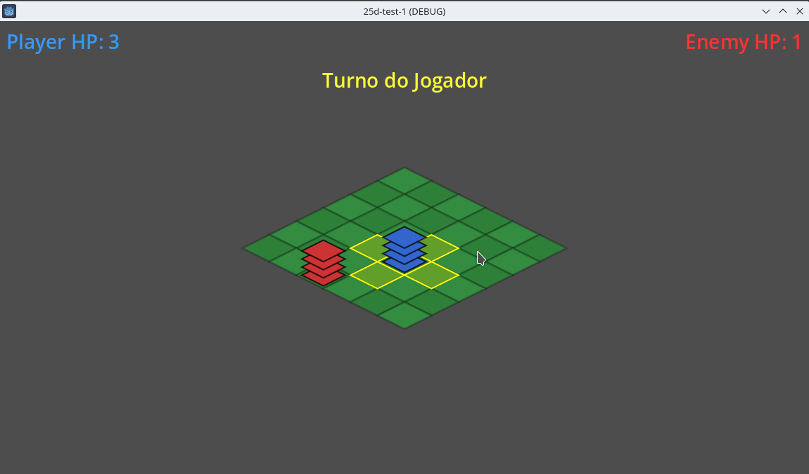

# Pseudo Final Fantasy Tactics Demo

## Pseudo FFT with 2.5d view and proc gen

Ver 0.1 - 2.5d view and procedural generation ok.

Simple "Chess / Final Fantasy Tactics-esque" turn-based game using 2.5d camera angle view, procedural generated enemy position with simple AI and HP counter.

Controls: 

WASD - movement.

Space - deal damage.

Feedback as always is very welcome.

 

